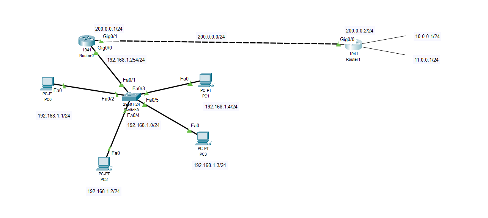

# Static-NAT-Configuration-Cisco
# Static NAT Configuration on Cisco Routers

## 📡 Project Overview

This project demonstrates the implementation of **Static NAT (Network Address Translation)** on a Cisco Router (Router0) to translate private IP addresses (192.168.1.0/24) to public IP addresses (200.0.0.0/24). Router1 simulates an external network with loopback interfaces acting as remote services or servers.

---

## 🖥️ Network Topology

- **Inside Network:** 192.168.1.0/24 (private)
- **Outside Network:** 200.0.0.0/24 (public)
- **Router1 External Loopbacks:**
  - Loopback0: 10.0.0.1/24
  - Loopback1: 11.0.0.1/24

---

## 🔧 Configuration Details

### **Router0 - Static NAT Configuration**
- Inside Interface: `Gig0/0`
- Outside Interface: `Gig0/1`
- Static NAT mappings (One-to-One):
  - `192.168.1.1` → `200.0.0.11`
  - `192.168.1.2` → `200.0.0.12`
  - `192.168.1.3` → `200.0.0.13`
  - `192.168.1.4` → `200.0.0.14`

### **Router1 - External Router Configuration**
- Outside Interface: `Gig0/0`
- Loopbacks: 
  - `Loopback0` as `10.0.0.1/24`
  - `Loopback1` as `11.0.0.1/24`

---

## 📝 Files Included
- `configs/router0_nat_config.txt`: Static NAT configuration for Router0.
- `configs/router1_loopback_config.txt`: External router and loopback configuration.
- `topology/topology.png`: The network topology diagram.

---

## 🧪 How to Test

1. Configure PCs with IPs `192.168.1.1 - 192.168.1.4` with gateway `192.168.1.254`.
2. Ping `10.0.0.1` or `11.0.0.1` from any PC.
3. Verify NAT table using `show ip nat translations` on Router0.

---

## 🚀 Future Improvements
- Implement **PAT (Port Address Translation)**.
- Add **ACLs** for access control.
- Extend to **dynamic NAT** with pools.

---

## 📚 Tech Stack
- Cisco Packet Tracer
- Cisco IOS CLI

---

## 🧑‍💻 Author

- **Jatin Choudhary** | Cisco Networking Enthusiast

---

